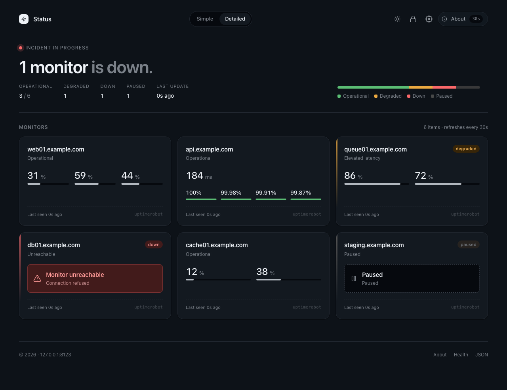

# simple-status-page

A fast, lightweight, self-hosted status page for servers and services.



Vanilla PHP backend, vanilla JS/Preact frontend, a single JSON config file.
No database, no message queue, no telemetry. MIT licensed.

## Features

- **Providers built in:** [Beszel](https://github.com/henrygd/beszel) for self-hosted server metrics, [UptimeRobot](https://uptimerobot.com/) for external uptime checks. Both are read-only.
- **One-click onboarding:** first request prompts for an admin password; everything else is configured through the in-page settings drawer.
- **Discovery wizard** for adding instances — pick a provider, enter credentials, choose which items to show.
- **Severity model:** per-element thresholds (CPU/mem/disk/response-time/uptime windows) roll up into per-card severity, then into the page-level hero. Per-item threshold overrides editable from the Catalog tab.
- **Live appearance:** admin-set defaults (theme, accent, density, card style, summary bar, sparklines) layer with per-viewer overrides in localStorage.
- **4 auth methods:** session form, HTTP Basic, Bearer token (CSRF-exempt), Caddy-validated client certificates. Last-method lockout guard.
- **Stale-while-revalidate** state pipeline with per-instance exponential backoff; provider outages don't blank the page.
- **CSP-strict** (`script-src 'self'` + a single hashed inline import map); no third-party JS.

## Requirements

- PHP 8.2+ with extensions: `curl`, `json`, `openssl`, `opcache`
- Web server: Caddy 2.7+ + PHP-FPM (see `Caddyfile.example`), or any server that routes requests to `public/index.php`
- Node.js 18+ (only to run `npm run vendor` once after pulling)

## Quick start

```sh
git clone https://github.com/appulize/simple-status-page
cd simple-status-page

# Copy vendor JS into public/assets/vendor/ (also committed, but re-run after pulling)
npm install
npm run vendor

# Set permissions for the runtime data directories
chown -R www-data:www-data config/ cache/
chmod 700 config/ cache/ cache/sessions/ cache/throttle/

# Drop the example Caddyfile in place and edit your hostname
cp Caddyfile.example /etc/caddy/Caddyfile
sudo systemctl reload caddy
```

Open the site in a browser. On first request you'll see an onboarding overlay
asking for an admin password (min 8 chars). Set it, then click the cog icon to
add your first provider via the discovery wizard.

### Docker

The container stores all mutable state under `/data`. Use a named volume so
settings, sessions, and cached provider state survive upgrades:

```sh
docker run -d \
  --name simple-status-page \
  --restart unless-stopped \
  -p 8080:80 \
  -v simple-status-page-data:/data \
  maciekish/simple-status-page:latest
```

Then open `http://localhost:8080` and complete onboarding. For local builds,
run `docker compose up --build -d` (or `docker-compose up --build -d` with the
legacy Compose client).

Published images support both `linux/amd64` and `linux/arm64`. Stable semver
tags are available as the exact version (`1.2.3`), minor line (`1.2`), and
`latest`.

`config/settings.json` is created automatically and ignored by git. The password
is bcrypt-hashed inside that file; there is no separate user database.

## Providers

### Beszel

Beszel is a self-hosted server-monitoring hub built on PocketBase. simple-status-page reads via its REST API as any normal user — no admin token required.

**Recommended:** set `SHARE_ALL_SYSTEMS=true` on the Beszel hub so a single read-only user can list every system without per-record assignment.

```sh
# In your Beszel hub deployment (compose/env/systemd):
SHARE_ALL_SYSTEMS=true
```

Alternatively, leave that env var unset and assign each system explicitly to the user simple-status-page will authenticate as. The discovery wizard surfaces both NICs and additional filesystems as child items; they default hidden and can be toggled per parent.

### UptimeRobot

Create a read-only "Monitor-specific" or main API key in your UptimeRobot account settings. The wizard accepts the key directly. Up to 50 monitors per page are paginated automatically; per-window uptime ratios are pulled for 24h / 7d / 30d / 90d.

## Updating

```sh
cd /srv/simple-status-page
git pull
npm install
npm run vendor
# PHP-FPM picks up changes on the next request; no restart needed for opcache.
```

Settings carry forward — `config/settings.json` schema migrations run lazily on first read and are written back atomically.

## Backup

The only file you need is `config/settings.json`. Everything else (`cache/`, `tests/e2e/.tmp/`, etc.) is reproducible state. A daily copy is enough:

```sh
cp /srv/simple-status-page/config/settings.json \
   /var/backups/simple-status-page/settings.$(date +%F).json
```

## Recovery (lost admin password)

The onboarding overlay re-appears whenever `auth.passwordHash` is empty.

```sh
# stop the web server first, then:
jq '.auth.passwordHash = ""' config/settings.json > config/settings.json.tmp
mv config/settings.json.tmp config/settings.json
# restart, then visit the site to re-onboard.
```

This loses no settings other than the password. Sessions are invalidated by the missing hash on next login attempt.

## Security

See `SECURITY.md` for the threat model and reporting process. A few points worth pulling forward:

- `/api/state` is intentionally **public** (that's the point of a status page). Do not surface anything on it you wouldn't put on a public wall poster.
- The client-certificate auth method trusts a request header. It requires a reverse-proxy directive (`header_up X-Client-Cert-Subject {tls_client_subject}` in Caddy — see `Caddyfile.example`) to prevent header spoofing.
- First-run onboarding is unauthenticated by design: the first visitor sets the admin password. Block external access until you've completed setup, or do it from `localhost`.

## Browser support

Requires native ES module + import map support: Chrome/Edge 89+, Safari 16.4+, Firefox 108+. No bundler, no transpile step.

## Testing

PHP unit tests (no browser):

```sh
php tests/run.php
```

Browser tests (Playwright, headless Chromium) run the real app against a temporary data directory — your `config/settings.json` is never touched:

```sh
# one-time
npm install
npx playwright install chromium
cp tests/e2e/.env.example tests/e2e/.env   # then edit values

npm run test:e2e             # headless
npm run test:e2e:headed      # see the browser
npm run test:e2e:ui          # Playwright UI mode (best for debugging)
npm run test:e2e:report      # open the HTML report from the last run
```

The screenshot at the top of this README is regenerated by `tests/e2e/specs/20-screenshot-generator.spec.ts` from a fixed seeded payload — re-run the suite after intentional visual changes and commit the updated PNG.

Numbered per-test screenshots land in `test-results/<test-name>/NN-label.png`. The HTML report (`playwright-report/`) embeds the same screenshots plus traces and videos. Both directories are gitignored.

## File layout

```
public/             web root (front controller + assets + API endpoints)
  index.php         SPA shell, security headers, importmap
  api/*.php         JSON endpoints (auth, settings, state, discover, …)
  assets/           CSS, vanilla JS modules, vendored Preact + htm
src/                PHP classes (PSR-4, App\ → src/)
  Auth/             session, throttle, password, token, client-cert
  Config/           settings store, migrations, validators
  Http/             request, JSON response, CSRF helpers
  Providers/        Beszel + UptimeRobot + provider registry
  State/            aggregator, cache, evaluator, backoff, HTTP client
config/             runtime config (settings.json, gitignored)
cache/              runtime cache (state.json, sessions, throttle, gitignored)
bin/                vendor.mjs (node), regen_state.php (background worker)
tests/              PHP unit tests + e2e/ (Playwright)
docs/               screenshots, additional docs
```

## License

MIT — see `LICENSE`.
